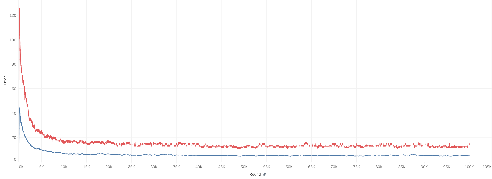
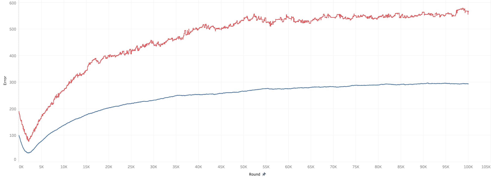
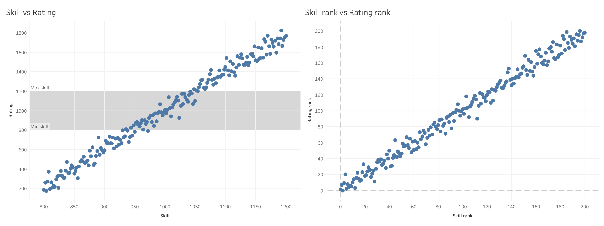
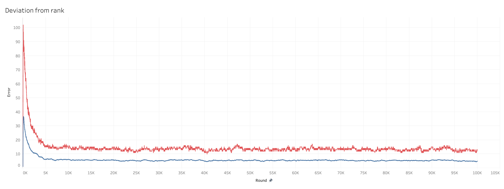
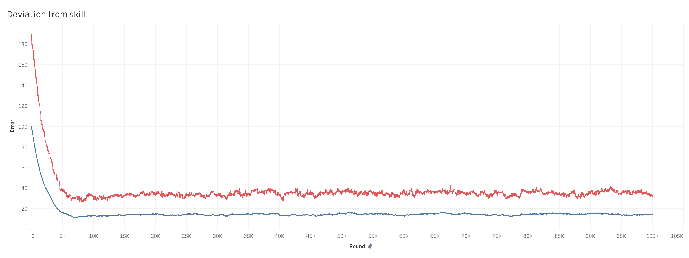
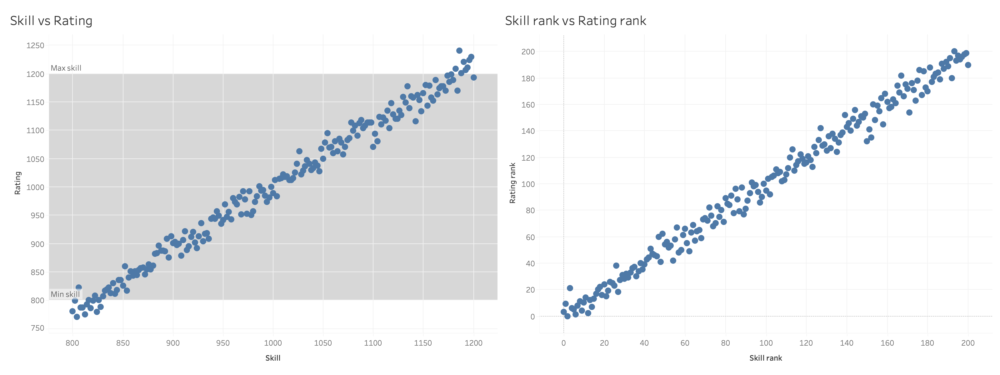

## Analyzing the quality of Elo-based ranking algorithms for table foosball rankings

### The game
The game we are modelling is table soccer, foosball or what you might like to call it. I assume that you know it, but here are some assumptions that we are working from.
- It is played as 1v1 or 2v2
- The first side to get 10 points wins the game.

### Initialization
We start by initializing 201 players with skill levels ranging uniformly from 800 to 1200. The average and median skill level will thus be 1000, which is also the initial value of the players' rating. The skill level is used when calculating the outcome of the games, but is otherwise assumed to be unknown. The skill level is supposed to model how well real life players play, which is not directly measurable (and if it was, then a complicated system like this would not be necessary).

### Objectives
The objective of the ranking system is to:
- obtain an ordering of the players as close as possible to the ordering by skill level
- obtain a rating of each player which should be as close as possible to their true skill level
- reach that rating as fast as possible
- maintain a degree of "fairness"

### Other assumptions
We have to make some assumptions to not over-complicate the simulations:
- A player's skill level is constant throughout the series of simulated games

## First run - 1v1 classic Elo
In the first evaluation, and as a bit of a warm-up and intro to the setup, we use the classic Elo ranking system known from chess on 1v1 games. A game is either won or lost, and the winner is the player with the most points at the end of the game. The procedure is described here:
``` python
def run():
    player_list = init_players()
    for i in range(100000):
        p1, p2 = get_two_random_players(player_list)
        prob_p1_win_skill = get_probability_skill(p1, p2)
        prob_p1_win_rating = get_probability_rating(p1, p2)
        p1_score, p2_score = get_result(prob_p1_win_skill)
        rating_delta = get_rating_delta(prob_p1_win_rating, p1_score, p2_score)
        p1.rating += rating_delta
        p2.rating -= rating_delta

def get_result(prob_p1_win: float):
    p1_score = 0
    p2_score = 0
    while p1_score < 10 and p2_score < 10:
        rand = random.random()
        if rand < prob_p1_win:
            p1_score += 1
        else:
            p2_score += 1
    return p1_score, p2_score
```

First the list of 201 players is initialized. Then 100,000 games are simulated. For each game, the probability of player 1 winning is calculated based on first skill level (how good the players actually are) and based on rating (how good the rating system assumes that they are). The outcome of the game is calculated based on their skill, and the rating delta (how much to add to player 1 and subtract from player 2) is calculated based on the outcome of the game and the probability based on their ratings. Finally, the ratings are updated, and the loop moves on to the next game.

For this experiment, the rating delta function is defined as follows:
``` python
def get_rating_delta(prob_p1_win: float, p1_score: int, p2_score: int):
    p1_win_ratio = 0
    if p1_score > p2_score:
        p1_win_ratio = 1
    k = 32
    return k * (p1_win_ratio - prob_p1_win)
```

We set the score to 0 or 1 and K to 32 per the definition of the original Elo function.

### Results
After each game, we save the values of all players to a csv file, which we use for plotting the graphs below. For each evaluation we will use 3 charts like the ones below.
#### Deviation from true ranking
This chart shows the average (blue, below) and 90th percentile (red, above) of the differences between the players' ranking determined by the ranking function and their true ranking based on their skill level.


#### Deviation from true skill level
This chart shows the average (blue, below) and 90th percentile (red, above) of the differences between the players' rating and their skill level.


#### Final ranks and ratings
This chart shows the final ranks and ratings compared to the true ranks and skill levels. The greyed area on the skill vs rating chart shows the span of the skill levels.


## Introducing margin of victory
In the first run we viewed a game as either won or lost, while reality is more granular. 
In reality, a game can be won by a little, like 10-9, or by a lot, like 10-0. This is also known as "margin of victory", and we might be able to use this to better adjust the rating of the players.
If for example player 1 is expected to win with 66,7 % chance, and the game ends 10-5, then the rating was correct, and nothing should need to change.
We can implement this by simply changing the get_rating_delta function:
``` python
def get_rating_delta(prob_p1_win: float, p1_score: int, p2_score: int):
    p1_win_ratio = p1_score / (p1_score + p2_score)
    k = 32
    return k * (p1_win_ratio - prob_p1_win)
```

### Results
Chart descriptions are the same as in the first run.
#### Deviation from true ranking


#### Deviation from true skill level


#### Final ranks and ratings


## Does it "feel fair"?
With the introduction of margin of victory, we also introduced the property that a player might get the most points while still losing rating points.
This can occur when the difference in rating between two players is very large, and the better player does not win "enough" over the less good player.
Example: the rating system estimates that player 1 will win with 66.67 % chance over player 2. The game ends 10-8 to player 1, which means that player 1 got 55.55 % of the goals - 11.12 percent points less than estimated.
This means that player 2 actually played better than what the rating system had expected, and from a technical point of view, the ratings should be adjusted in favor of player 2.
However, player 1 would be considered winner of the game, and thus it can feel unfair to player 1 to lose rating after winning a game.
